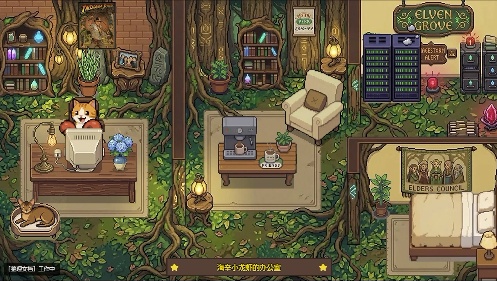

# Star Office UI

🌐 Language: [中文](./README.md) | **English** | [日本語](./README.ja.md)


**A pixel office dashboard for multi-agent collaboration** — visualize your AI assistants' (OpenClaw / "lobster") work status in real time, so you can see at a glance who's doing what, what they did yesterday, and whether they're online.

> This is a **co-created project by Ring Hyacinth and Simon Lee**.

---

## ✨ 30-Second Quick Start

```bash
# 1) Clone the repo
git clone https://github.com/ringhyacinth/Star-Office-UI.git
cd Star-Office-UI

# 2) Install dependencies
python3 -m pip install -r backend/requirements.txt

# 3) Initialize state file (first run)
cp state.sample.json state.json

# 4) Start the backend
cd backend
python3 app.py
```

Open **http://127.0.0.1:18791** and try switching states:

```bash
python3 set_state.py writing "Organizing documents"
python3 set_state.py error "Found an issue, debugging"
python3 set_state.py idle "Standing by"
```



---

## 📋 Features

1. **Status Visualization** — 6 states (`idle` / `writing` / `researching` / `executing` / `syncing` / `error`) mapped to different office areas with animated sprites and speech bubbles
2. **Yesterday Memo** — Automatically reads the latest daily log from `memory/*.md`, sanitizes it, and displays it as a "Yesterday Memo" card
3. **Multi-Agent Collaboration** — Invite other agents to join your office via join keys and see everyone's status in real time
4. **Trilingual UI** — Switch between Chinese, English, and Japanese with one click; all UI text, bubbles, and loading messages update instantly
5. **Custom Art Assets** — Manage characters, scenes, and decorations through the sidebar; dynamic frame sync prevents flickering
6. **AI-Powered Room Design** — Connect your own Gemini API to generate new office backgrounds (recommended: `nanobanana-pro` / `nanobanana-2`); core features work fine without an API
7. **Mobile-Friendly** — Open on your phone for a quick status check on the go
8. **Security Hardening** — Sidebar password protection, weak-password blocking in production, hardened session cookies
9. **Flexible Public Access** — Use Cloudflare Tunnel for instant public access, or bring your own domain / reverse proxy
10. **Desktop Pet Mode** — Optional Tauri desktop wrapper that turns the office into a transparent desktop widget (see below)

---

## 🚀 Getting Started

### 1) Install dependencies

```bash
cd Star-Office-UI
python3 -m pip install -r backend/requirements.txt
```

### 2) Initialize state file

```bash
cp state.sample.json state.json
```

### 3) Start the backend

```bash
cd backend
python3 app.py
```

Open `http://127.0.0.1:18791`

> ✅ For local development you can start with the defaults; in production, copy `.env.example` to `.env` and set strong random values for `FLASK_SECRET_KEY` and `ASSET_DRAWER_PASS` to avoid weak passwords and session leaks.

### 4) Switch states

```bash
python3 set_state.py writing "Organizing documents"
python3 set_state.py syncing "Syncing progress"
python3 set_state.py error "Found an issue, debugging"
python3 set_state.py idle "Standing by"
```

### 5) Public access (optional)

```bash
cloudflared tunnel --url http://127.0.0.1:18791
```

Share the `https://xxx.trycloudflare.com` link with anyone.

### 6) Verify your installation (optional)

While the backend is running, you can run a lightweight smoke test to confirm that the core endpoints are healthy:

```bash
python3 scripts/smoke_test.py --base-url http://127.0.0.1:18791
```

If all checks report `OK`, your Star Office UI service is wired up correctly for basic status flows.

---

## 🦞 For OpenClaw Users

> If you're using [OpenClaw](https://openclaw.com), these three steps deeply integrate your lobster with the pixel office.

### 4.1 Install the Skill

Copy `SKILL.md` from the repo into your OpenClaw workspace:

```bash
cp SKILL.md ~/.openclaw/workspace/SKILL.md
```

Your lobster will read it automatically and follow the deployment guide — starting the backend, setting up a public link, and prompting you for passwords and API keys.

### 4.2 Automatic Status Sync

Add the following rule to your `SOUL.md` (or agent config) so your lobster updates its status automatically:

```markdown
## Star Office Status Sync Rules
- When starting a task: run `python3 set_state.py <state> "<description>"` before beginning work
- When finishing a task: run `python3 set_state.py idle "Standing by"` before replying
```

**6 states → 3 office areas:**

| State | Office Area | When to use |
|-------|-------------|-------------|
| `idle` | 🛋 Breakroom (sofa) | Standing by / task complete |
| `writing` | 💻 Workspace (desk) | Writing code or docs |
| `researching` | 💻 Workspace | Searching / researching |
| `executing` | 💻 Workspace | Running commands / tasks |
| `syncing` | 💻 Workspace | Syncing data / pushing |
| `error` | 🐛 Bug Corner | Error / debugging |

### 4.3 Invite Other Lobsters to Your Office

**Step 1: Prepare join keys**

The repo ships with `join-keys.json` (containing `ocj_starteam01` through `ocj_starteam08`), each supporting up to 3 concurrent users. Feel free to add your own keys.

**Step 2: Have the guest run the push script**

The guest only needs to download `office-agent-push.py` and fill in 3 variables:

```python
JOIN_KEY = "ocj_starteam02"          # The key you assign
AGENT_NAME = "Alice's Lobster"       # Display name
OFFICE_URL = "https://office.hyacinth.im"  # Your office URL
```

```bash
python3 office-agent-push.py
```

The script auto-joins and pushes status every 15 seconds. The guest's lobster will appear on the dashboard, moving to the appropriate area based on its state.

**Step 3 (optional): Guest installs a Skill**

Guests can also use `frontend/join-office-skill.md` as a Skill — their lobster will handle setup and pushing automatically.

> See [`frontend/join-office-skill.md`](./frontend/join-office-skill.md) for full guest onboarding instructions.

---

## 📡 API Reference

| Endpoint | Description |
|----------|-------------|
| `GET /health` | Health check |
| `GET /status` | Get main agent status |
| `POST /set_state` | Set main agent status |
| `GET /agents` | List all agents |
| `POST /join-agent` | Guest joins the office |
| `POST /agent-push` | Guest pushes status |
| `POST /leave-agent` | Guest leaves |
| `GET /yesterday-memo` | Get yesterday's memo |
| `GET /config/gemini` | Get Gemini API config |
| `POST /config/gemini` | Set Gemini API config |
| `GET /assets/generate-rpg-background/poll` | Poll image generation progress |

---

## 🖥 Desktop Pet Mode (Optional)

The `desktop-pet/` directory contains a **Tauri**-based desktop wrapper that turns the pixel office into a transparent desktop widget.

```bash
cd desktop-pet
npm install
npm run dev
```

- Auto-launches the Python backend on startup
- Window points to `http://127.0.0.1:18791/?desktop=1` by default
- Customizable via environment variables for project path and Python path

> ⚠️ This is an **optional, experimental feature**, primarily developed and tested on macOS. See [`desktop-pet/README.md`](./desktop-pet/README.md) for details.

---

## 🎨 Art Assets & License

### Asset Attribution

Guest character animations use free assets by **LimeZu**:
- [Animated Mini Characters 2 (Platformer) [FREE]](https://limezu.itch.io/animated-mini-characters-2-platform-free)

Please keep attribution when redistributing or demoing, and follow the original license terms.

### License

- **Code / Logic: MIT** (see [`LICENSE`](./LICENSE))
- **Art Assets: Non-commercial use only** (learning / demo / sharing)

> For commercial use, replace all art assets with your own original artwork.

---

## 👥 Authors

This project is co-created and maintained by **Ring Hyacinth** and **Simon Lee**.

- **Ring Hyacinth** — [@ring_hyacinth](https://x.com/ring_hyacinth)
- **Simon Lee** — [@simonxxoo](https://x.com/simonxxoo)

---

## 📝 Changelog

| Date | Summary | Details |
|------|---------|---------|
| 2026-03-01 | 🎉 **v2 Rebuild** — Trilingual support, asset management system, AI room design, full art asset overhaul | [`docs/FEATURES_NEW_2026-03-01.md`](./docs/FEATURES_NEW_2026-03-01.md) |
| 2026-03-03 | 📋 Open-source release checklist completed | [`docs/OPEN_SOURCE_RELEASE_CHECKLIST.md`](./docs/OPEN_SOURCE_RELEASE_CHECKLIST.md) |
| 2026-03-04 | 🔒 P0/P1 Security hardening — weak password blocking, backend refactor, stale-state auto-idle, skeleton loading | [`docs/UPDATE_REPORT_2026-03-04_P0_P1.md`](./docs/UPDATE_REPORT_2026-03-04_P0_P1.md) |
| 2026-03-05 | 📱 Stability fixes — CDN cache fix, async image generation, mobile sidebar UX, join key expiration & concurrency | [`docs/UPDATE_REPORT_2026-03-05.md`](./docs/UPDATE_REPORT_2026-03-05.md) |

---

## 📁 Project Structure

```text
Star-Office-UI/
├── backend/            # Flask backend
│   ├── app.py
│   ├── requirements.txt
│   └── run.sh
├── frontend/           # Frontend pages & assets
│   ├── index.html
│   ├── join.html
│   ├── invite.html
│   └── layout.js
├── desktop-pet/        # Tauri desktop wrapper (optional)
├── docs/               # Documentation & screenshots
│   └── screenshots/
├── office-agent-push.py  # Guest push script
├── set_state.py          # Status switch script
├── state.sample.json     # State file template
├── join-keys.json        # Join key config
├── SKILL.md              # OpenClaw Skill
└── LICENSE               # MIT License
```

---

## ⭐ Star History

[](https://www.star-history.com/?repos=ringhyacinth%2FStar-Office-UI&type=date&legend=top-left)
